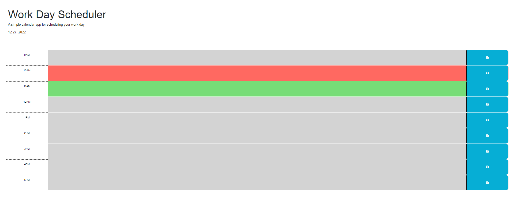
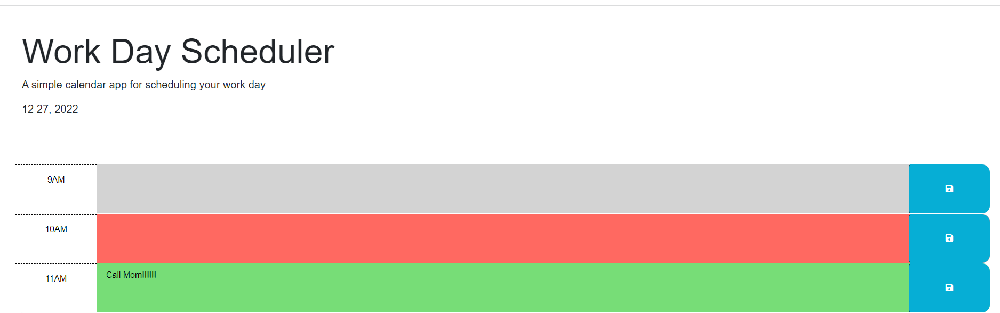

# workTimeScheduler
## Description
This is an app that helps the user schedule tasks during working hours in that current day. It is a user friendly app that uses colour coding to let the user be able to easily identify hours in the past (highlighted in grey), present (highlighted in red) and future (highted in green).

## Installation
N/A

## Usage
- Upon opening the page you will see the landing page for the workTimeScheduler. 
- User can update the relevant time slot for a task/ meeting scheduled. 
- This update will be saved to local storage once the save button is clicked and upon refreshing the page this will be still available to the user.

## License
Please refer to LICENSE in the repo